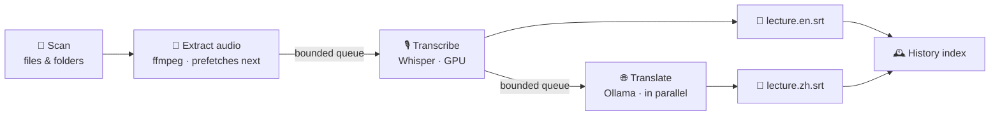

<div align="center">

# 🎬 Scripto

**Turn a whole folder of videos into tidy bilingual subtitles — entirely on your own computer.**

[](LICENSE)
[](pyproject.toml)
[](#-quick-start)
[](tests/)

**English** | [简体中文](README.zh.md)

</div>

## What is this?

You have a semester of recorded lectures, a pile of conference talks, or interviews you keep meaning to go through — and none of them have subtitles, let alone translated ones.

Scripto exists for exactly that: **pick a folder, hit Start, walk away.** When you come back, every video has its subtitle files sitting right next to it — the original transcript and, if you want, a translation, all named to match:

```
os-lecture-03.mp4
os-lecture-03.en.srt   ← transcript
os-lecture-03.zh.srt   ← translation
```

No uploads, no queues, no subscriptions. Transcription runs on a Whisper model on your machine; translation runs on your local Ollama. **Your audio and text never leave your computer** — it works with the network cable unplugged.

## Who is it for?

- 🎓 **Students with recorded courses** — batch-convert a semester of lectures into searchable, reviewable subtitles and transcripts
- 🗣️ **Anyone watching foreign-language talks** — audio in one language, side-by-side bilingual subtitles out
- 🎙️ **People who transcribe meetings & interviews** — drop recordings in, get timestamped text back (srt/txt/vtt/json)
- 🔏 **Anyone who cares about privacy** — sensitive recordings that must not touch a cloud? There is no cloud here

## What does it feel like to use?

1. **Double-click to open** — a proper .app on macOS, a one-click launcher on Windows; a two-step wizard (language + model) gets you started, models download in-app
2. **Drag or paste** any mix of files and folders, even from different drives; already-processed files are skipped automatically, so re-feeding your whole library is always safe
3. **Hit Start** — the bottom bar always shows the current file, overall progress, and an ETA; stop anytime without losing finished work
4. Flip on **Translate** and, while file #2 is transcribing, file #1 is already being translated in parallel
5. The **History** page remembers every file: reopen it later, switch between language versions, translate the missing one with a click — and if you've deleted the output, it tells you honestly

The interface switches between English and 中文 live, follows your system's dark mode, and when anything is missing the built-in **doctor** tells you exactly what to install and which command fixes it — no programming required.

## 🚀 Quick start

**macOS**

```bash
brew install ffmpeg uv            # system deps: audio handling + env manager
brew install ollama               # optional — only needed for translation
git clone https://github.com/TN019/scripto.git && cd scripto
bash launchers/macos/build_app.sh # builds dist/Scripto.app
```

Drag `dist/Scripto.app` into Applications and double-click from now on — or just run `uv run scripto`.

**Windows** (PowerShell)

```powershell
winget install ffmpeg
powershell -ExecutionPolicy ByPass -c "irm https://astral.sh/uv/install.ps1 | iex"
# optional translation: winget install Ollama.Ollama
git clone https://github.com/TN019/scripto.git; cd scripto
```

From then on, double-click `launchers\Scripto.bat` (or `Scripto.vbs` for no console window).

Everything else installs itself on first launch — no Python wrangling.

## 🏭 Why is it fast — and why doesn't it blow up your RAM?

Batch-processing dozens of long videos has two classic failure modes: **slow** and **out of memory**. Scripto's core is a staged pipeline — three stations working simultaneously like a factory line, instead of each file queuing through every step:



- The engine picks itself per platform: mlx-whisper on Apple Silicon (Metal), faster-whisper on Windows (plain CPU works; NVIDIA GPUs accelerate automatically)
- Three-hour recordings are chunked, transcribed, and re-stitched with seamless timestamps, capping memory
- On 16 GB machines, *low-memory mode* translates only after transcription finishes — one large model resident at a time
- Every stage has timeouts and isolation: a broken file gets logged and skipped, never dragging down the batch

These aren't slogans — they're acceptance metrics measured on every release (scripts in [`benchmarks/`](benchmarks/), reproducible by anyone):

| Metric | Target | Measured |
|---|---|---|
| Batch wall time (20 files + translation) | approach theoretical floor | only **4.6%** above |
| Memory across a 20-file batch | flat | **+0.1%** |
| Translation batch first-try success | > 95% | **100%** |
| UI with 500 files | responsive | **< 50 ms/tick** refresh |
| Stop → fully idle | < 5 s | ✅ |

## 💻 Prefer the command line?

Everything the GUI does, scriptable:

```bash
uv run scripto-cli run ~/Videos/course --model large-v3-turbo --translate --target zh
uv run scripto-cli doctor      # environment check with fixes
```

## ❓ FAQ

**"Operation not permitted" on macOS** — a system privacy permission is missing: System Settings → Privacy & Security → Files and Folders, grant access to your terminal or Scripto (or move files out of Desktop/Documents/Downloads). Scripto detects this case and says so explicitly.

**iCloud files fail** — the file hasn't been downloaded from the cloud yet: right-click → "Download Now" in Finder, then retry. Scripto identifies and reports this case.

**Translation says Ollama is down** — start it with `ollama serve`, then pull a model in Settings → Manage models (`qwen3:8b` recommended, `qwen3:4b` for low-RAM machines).

**Files with existing subtitles get skipped** — that's the default (no wasted work); enable *Overwrite* in Settings to regenerate.

## 🛠️ For developers

```bash
uv sync && uv run pytest                 # fast suite, no model downloads
SCRIPTO_ENGINE_SMOKE=1 uv run pytest     # + real engine smokes
SCRIPTO_OLLAMA_SMOKE=1 uv run pytest     # + real translation smoke
```

Architecture and design decisions live in [docs/PLAN.md](docs/PLAN.md). House rules: the core layer never imports UI, the interface only ever applies incremental updates, every subprocess has a timeout, and a failed translation never corrupts a subtitle file.

## 📄 License

[MIT](LICENSE) © 2026 TN019
