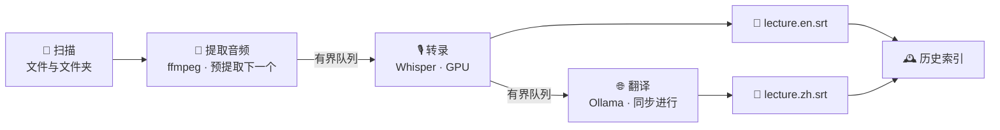

<div align="center">

# 🎬 Scripto

**把一整个文件夹的视频，变成整理好的双语字幕——全程在你自己的电脑上。**

[](LICENSE)
[](pyproject.toml)
[](#-快速开始)
[](tests/)

[English](README.md) | **简体中文**

</div>

## 这是什么？

你有一学期的网课录像、几十场讲座录音、或者一堆想认真看的英文演讲——但它们没有字幕，或者没有中文字幕。

Scripto 就是为这件事做的：**选中文件夹，点开始，去干别的**。回来时每个视频旁边都多了字幕文件——英文原文一份、中文翻译一份，文件名对得整整齐齐：

```
操作系统_第3讲.mp4
操作系统_第3讲.en.srt   ← 转录
操作系统_第3讲.zh.srt   ← 翻译
```

没有上传、没有排队、没有会员费。转录用你电脑上的 Whisper 模型，翻译用你电脑上的 Ollama——**你的录音和文字从头到尾不离开你的机器**，断网也照样工作。

## 它适合谁？

- 🎓 **上网课的人** —— 一学期的课程录像批量转成可搜索、可复习的字幕和文稿
- 🗣️ **听英文讲座/演讲的人** —— 英文音频进，中英双语字幕出，边看边对照
- 🎙️ **整理会议和访谈的人** —— 录音丢进去，出来就是带时间戳的文字记录（srt/txt 任选）
- 🔏 **在意隐私的人** —— 内容敏感不想传云端？这里根本没有云端

## 用起来是什么感觉？

1. **双击打开**——macOS 是正常的 .app，Windows 双击一个启动器，第一次会有个两步向导（选语言、选模型，模型也是应用内一键下载）
2. **拖入或粘贴**任意文件、文件夹，来自不同磁盘位置也行；已经做过的文件自动跳过，所以你可以放心把整个资料库反复丢进来
3. **点开始**——底部一直能看到：当前在处理哪个文件、总进度、预计还要多久；中途想停就停，已完成的不受影响
4. 想翻译就打开**翻译**开关；转录第二个文件时，第一个的翻译已经在同步进行了
5. **历史页**记住你处理过的每个文件：随时回来切换中/英文版本查看，当时没翻译的现在补一键翻译；文件被你删了它也会如实告诉你

英文界面和中文界面一键切换，深色模式跟随系统。出了任何问题，内置的**环境体检**会直接告诉你缺什么、贴哪条命令能修——不需要你会编程。

## 🚀 快速开始

**macOS**

```bash
brew install ffmpeg uv            # 系统依赖：音频处理 + 环境管理
brew install ollama               # 可选——只有字幕翻译需要
git clone https://github.com/TN019/scripto.git && cd scripto
bash launchers/macos/build_app.sh # 生成 dist/Scripto.app
```

把 `dist/Scripto.app` 拖进「应用程序」，以后双击即用——或直接 `uv run scripto`。

**Windows**（PowerShell）

```powershell
winget install ffmpeg
powershell -ExecutionPolicy ByPass -c "irm https://astral.sh/uv/install.ps1 | iex"
# 可选翻译：winget install Ollama.Ollama
git clone https://github.com/TN019/scripto.git; cd scripto
```

以后双击 `launchers\Scripto.bat`（不想看到黑窗口就用 `Scripto.vbs`）。

其余依赖首次启动时自动安装，不需要手动折腾 Python。

## 🏭 为什么它快、为什么它稳？

批量处理几十个长视频，最怕两件事：**慢**和**内存爆**。Scripto 的核心是一条阶段化流水线——三个环节像工厂流水线一样同时开工，而不是一个文件从头排到尾：



- 转录引擎按平台自动选：Apple Silicon 用 mlx-whisper（Metal 加速），Windows 用 faster-whisper（普通 CPU 就能跑，有 NVIDIA 显卡自动加速）
- 3 小时的超长录音自动切段转录再无缝拼接，内存峰值被压平
- 16GB 内存的机器可切「低内存模式」：转录完再翻译，任一时刻只有一个大模型在内存里
- 每个环节都有超时和容错：一个坏文件只会被记录跳过，绝不拖垮整批

这些不是口号，是每次发版都实测的验收指标（脚本在 [`benchmarks/`](benchmarks/)，任何人可复跑）：

| 指标 | 目标 | 实测 |
|---|---|---|
| 批量总时长（20 文件含翻译） | 逼近理论下界 | 仅超出 **4.6%** |
| 连跑 20 个文件的内存 | 平稳不增长 | **+0.1%** |
| 翻译批次一次成功率 | > 95% | **100%** |
| 500 个文件时的界面 | 不卡顿 | 刷新 **< 50ms/拍** |
| 点停止到完全停下 | < 5 秒 | ✅ |

## 💻 喜欢命令行？

图形界面能做的都能脚本化：

```bash
uv run scripto-cli run ~/Videos/课程 --model large-v3-turbo --translate --target zh
uv run scripto-cli doctor      # 环境体检（带修复指引）
```

## ❓ 常见问题

**macOS 报 "Operation not permitted"** —— 系统隐私权限没给：系统设置 → 隐私与安全性 → 文件和文件夹，给你的终端或 Scripto 授权（或把文件移出 桌面/文稿/下载）。发生时 Scripto 会直接提示这个原因。

**iCloud 里的文件失败** —— 文件还在云端没下载：Finder 里右键 →「立即下载」再试。Scripto 会明确识别并提示这种情况。

**翻译提示 Ollama 未运行** —— 终端里 `ollama serve` 启动它，再到 设置 → 模型管理 拉一个模型（推荐 `qwen3:8b`，内存紧张用 `qwen3:4b`）。

**已有字幕的文件被跳过了** —— 这是默认行为（避免重复劳动）；要重新生成就在设置里打开「覆盖已有输出」。

## 🛠️ 开发者

```bash
uv sync && uv run pytest                 # 快速测试（不下载模型）
SCRIPTO_ENGINE_SMOKE=1 uv run pytest     # + 真实引擎冒烟
SCRIPTO_OLLAMA_SMOKE=1 uv run pytest     # + 真实翻译冒烟
```

架构与设计决策见 [docs/PLAN.md](docs/PLAN.md)。核心铁律：核心层不依赖 UI、界面只做增量更新、每个子进程都有超时、翻译失败永远不损坏字幕文件。

## 📄 License

[MIT](LICENSE) © 2026 TN019
